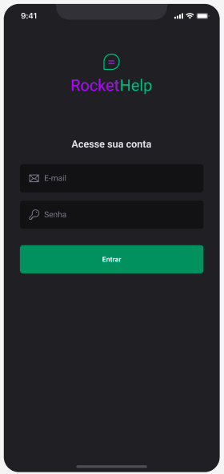
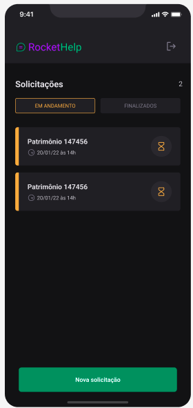
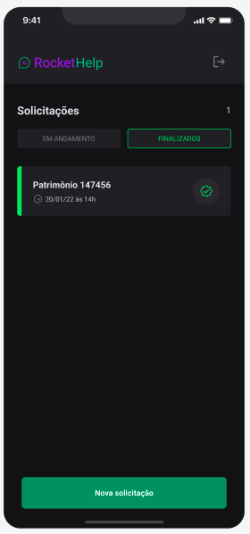
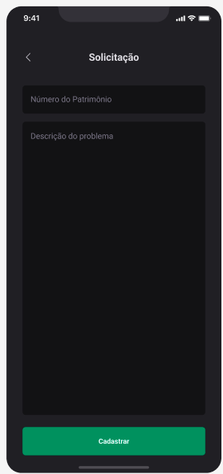
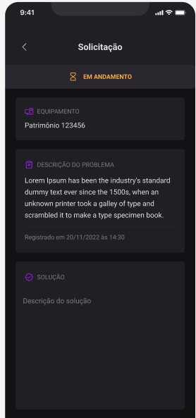

# Curso - RocketSeat

**Aplicação em React-Native** 
Aplicação realizada em React-Native utilizando o typescript. 
O app se trata de um helpdask onde é possivel criar usiarios e gerar e concluir solicitações desses usuários. 
Foi construida em um curso ministrado pela RocketSeat. 

  
  
  
  
  
  

